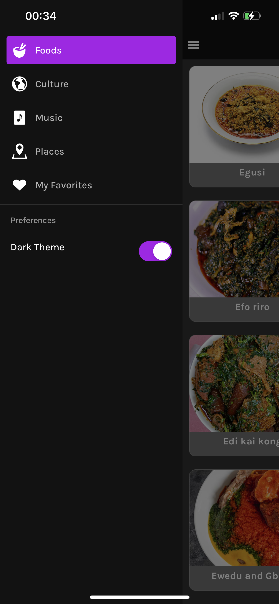
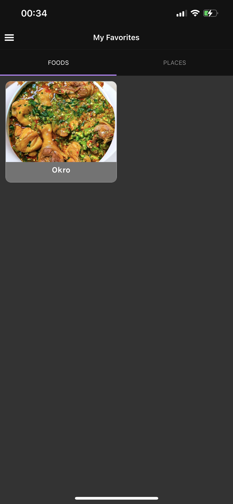

# Discover Nigeria

# App Details

Discover Nigeria via the language, food and music.

The app will consist of:

    └──Cultures Screen

    └──Culture details Screen

    └──Foods Screen

    └──Food details Screen

    └──Artists Screen

    └──Playlist Screen

    └──Year Screen

    └──Places Screen

    └──Place details Screen

    └──Favorite places Screen

    └──Favorite foods Screen

    └──Drawer

# Stack

    React Native (Expo Framework)
    TypeScript
    Redux - State management
    Cypress - Writing tests

# Top-level directory layout

    📦Discover-Nigeria
        📦assets
            📦fonts
                ┣ 📜Karla-Bold.ttf
                ┣ 📜Karla-Light.ttf
                ┣ 📜Karla-Medium.ttf
                ┗ 📜Karla-Regular.ttf
            📦images
                ┣ 📜IMG_4733.PNG
                ┣ 📜IMG_4736.PNG
                ┣ 📜IMG_4987.PNG
                ┣ 📜IMG_4788.PNG
                ┣ 📜IMG_4790.PNG
                ┗ 📜IMG_4991.PNG
            📦music
                ┗ 📜test.m4a
            ┣ 📜icon.png
            ┗ 📜splash.png
        📦components
            ┣ 📦Food
                ┗ 📜FoodGridTile.tsx
            ┗ 📦UI
                ┣ 📜BigImage.tsx
                ┣ 📜GridTile.tsx
                ┣ 📜Icon.tsx
                ┗ 📜Logo.tsx
        📦cypress
            ┣ 📦integration
                ┣ 📜CultureScreen.ts
                ┣ 📜FavoriteFoodScreen.ts
                ┣ 📜FavoritePlaceScreen.ts
                ┣ 📜FoodScreen.ts
                ┗ 📜MusicScreen.ts
        📦data
            ┣ 📜culture.ts
            ┣ 📜foods.ts
            ┣ 📜music.ts
            ┗ 📜places.ts
        📦navigation
            ┗ 📜AppNavigation.tsx
        📦screens
            ┣ 📦Culture
                ┣ 📜CultureDetailsScreen.tsx
                ┗ 📜CultureListScreen.tsx
            ┣ 📦Favorite
                ┣ 📜FoodFavorite.tsx
                ┗ 📜PlaceFavorite.tsx
            ┣ 📦Food
                ┣ 📜FoodDetailsScreen.tsx
                ┗ 📜FoodListScreen.tsx
            ┣ 📦General
                ┗ 📜DrawerContent.tsx
            ┣ 📦Music
                ┣ 📜ArtistsScreen.tsx
                ┣ 📜PlaylistsScreen.tsx
                ┗ 📜YearsScreen.tsx
            ┗ 📦Places
                ┣ 📜PlaceDetails.tsx
                ┗ 📜PlacesList.tsx
        📦store
            ┣ 📜actions.ts
            ┗ 📜reducers.ts
        📦themes
            ┗ 📜themes.ts
        📦types
            ┣ 📜navigations.ts
            ┗ 📜props.ts
        ┣ 📜App.tsx
        ┣ 📜app.json
        ┣ 📜babel.config.js
        ┣ 📜package-lock.json
        ┣ 📜package.json
        ┣ 📜README.md
        ┗ 📜yarn.lock

# Few Screenshots of screens in light and dark modes

 
 

# How to setup project and run locally

### Clone the repository

```
git clone https://github.com/gcodezz/Discover-Nigeria.git

```

### Install npm dependencies

```
npm install
```

### Install Expo package

```
expo install
```

### Start the react native bundler to test project on your device

Using expo

```
expo start
```
